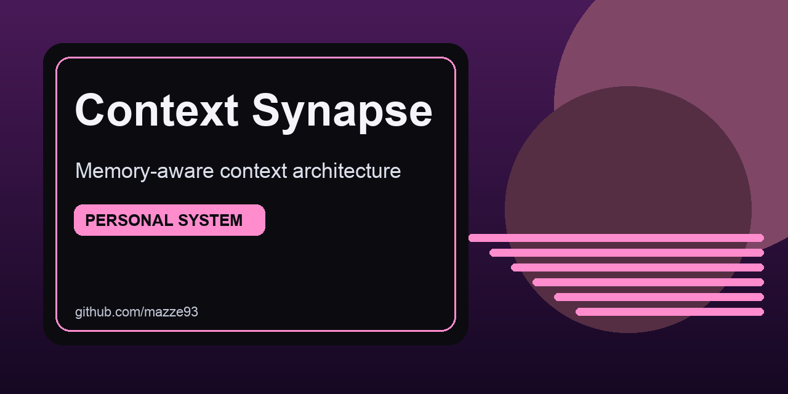

# Context Synapse




Local-first Bayesian context engine for LLMs. Treats context as a living system — it decays, rots, and forgets on purpose.

**Intentional fragility** over infinite retention. **Structural saliency** over keyword similarity. An externalized executive function layer for distracted brains.

Built in Swift 6.0+ for macOS. Zero cloud dependency. Zero telemetry.

## Why this exists

Most AI context systems fail because they accumulate. Context Synapse decays on purpose.

- Context is probabilistic and changes continuously.
- Signals can be missing or degraded — the system survives anyway.
- Learning must remain visible and reversible.
- The primary goal should always be findable, even when you've been deep in a rabbit hole for 45 minutes.

## Key features

- **Bayesian weighting** that adapts intent, tone, and domain priors via Beta update
- **Decay layer** — per-synapse weight state with utility-adjusted temporal decay
- **Rot detection** — semantic distance from Lighthouse × drift time × velocity amplifier
- **Lighthouse floor** — primary goal always saliency ≥ 0.4, always findable
- **Referee protocol** — FunctionalReferee (silent) or AbrasiveReferee (active friction, opt-in)
- **Fault injection** — controlled vector corruption for resilience testing
- **Local-first** — all state in `~/Library/Application Support/ContextSynapse/`
- **Multi-user** — isolated user namespaces with profile tracking
- **Export/Import** — full state snapshots with merge support

## Architecture

### SynapseCore — multi-file library

```
Sources/SynapseCore/
  SynapseCore.swift          # Bayesian engine: priors, triggers, regions, AI clients
  DecayConstants.swift       # Single source of truth for all decay/rot constants
  SynapseContent.swift       # Immutable content descriptor (file refs, function names)
  InteractionRecord.swift    # Timestamped event classification + successWeight mapping
  SemanticDistanceStrategy.swift  # Protocol + StructuralHeuristicDistance (Option A)
  SynapseWeightState.swift   # Per-synapse decay math, rot formula, lighthouse floor
  SynapseReferee.swift       # FunctionalReferee, AbrasiveReferee, RefereeConfig
```

### Data flow

```
User interaction → InteractionRecord → SynapseWeightState.record()
                                            ↓
                              utilityScore() × e^(-λ·t) → decayWeight()
                                            ↓
             StructuralHeuristicDistance(content, lighthouse) → recomputeRotScore()
                                            ↓
                      finalWeight() = max(floor, W_decay · (1 - α·RotScore))
                                            ↓
                         SynapseReferee.evaluateSaliency() → context window
```

### CLI Tool (`contextsynapse`)

Input: query + context flags. Output: `[Tone] [Intent] [Domain]: <query>`

Pipe-friendly: `echo "query" | contextsynapse`

### GUI (`ContextSynapseApp`)

SwiftUI macOS app. Weight grid, cosine similarity heatmap, fault slider, "Disintegrate Sky Plates" button.

## Design Principles

### 1. Context is probabilistic
Intent, tone, and domain are inferred and revised via Bayesian priors. The system learns by updating beliefs, not overwriting rules.

### 2. Systems should survive partial failure
Fault injection is first-class. Vectors degrade. Signals disappear. Assumptions fracture. The system continues producing useful output.

### 3. Interpretability is non-negotiable
All weights, priors, decay constants, and similarity matrices are visible. Nothing is hidden behind opaque heuristics.

### 4. Local-first is non-negotiable
All computation, learning, and persistence happen locally. Cloud integration is optional. Dependency is not.

### 5. Prompting is a cognitive process
Prompt construction is a dynamic interaction between intention, environment, history, and uncertainty. Strings are outputs, not the system.

### 6. Fragility is intentional
Controlled weak points expose assumptions and prevent false confidence.

### 7. Context decays and rots
Context without maintenance degrades. Saliency fades with time and drift. The system knows when it is losing the thread — and says so.

### 8. The Lighthouse must always be findable
The primary goal is protected by a hard saliency floor (≥ 0.4). No matter how far a side quest drifts, the lighthouse remains above the noise.

## Installation

### Prerequisites
- macOS 13.0+
- Xcode 15.0+ / Swift 6.0+

### Build from source

```bash
git clone https://github.com/mazze93/context-synapse.git
cd context-synapse
swift build -c release
.build/release/contextsynapse --help
```

See [INSTALL.md](INSTALL.md) for full build and GUI instructions.

## Quick Start

### CLI

```bash
# Basic query — picks intent/tone/domain stochastically from Bayesian priors
contextsynapse "Refactor the decay weight formula"

# With context signals
contextsynapse "Review pull request" --app Xcode --time 09:30 --domain Work

# Apply Bayesian feedback after a run
contextsynapse "Write release notes" --feedback good

# Force specific dimensions
contextsynapse "Explain rot detection" --intent Analyze --tone Technical --domain Work

# Export / import state
contextsynapse --export backup.json --metadata user=mazze
contextsynapse --import backup.json --merge

# Multi-user
contextsynapse --user mazze "Summarize this document"
```

### Programmatic

```swift
import SynapseCore

let core = SynapseCore(user: "mazze")

// Bayesian feedback
core.applyFeedbackUpdate(chosenIntent: "Analyze", chosenTone: "Technical", chosenDomain: "Work", positive: true)

// Decay state
var state = SynapseWeightState(synapseId: "current-task", isLighthouse: true)
state.record(.gitCommit)
let w = state.finalWeight()

// Referee
let config = RefereeConfig(mode: .abrasive, driftThresholdMinutes: 15)
let referee = config.makeReferee()
```

## Project Structure

```
context-synapse/
├── Sources/
│   ├── SynapseCore/
│   │   ├── SynapseCore.swift
│   │   ├── DecayConstants.swift
│   │   ├── SynapseContent.swift
│   │   ├── InteractionRecord.swift
│   │   ├── SemanticDistanceStrategy.swift
│   │   ├── SynapseWeightState.swift
│   │   └── SynapseReferee.swift
│   ├── contextsynapse/
│   │   └── main.swift
│   └── ContextSynapseApp/
│       ├── AppMain.swift
│       ├── ContentView.swift
│       ├── WeightGridView.swift
│       ├── HeatmapView.swift
│       └── AppShortcutsBridge.swift
├── Tests/
│   ├── BayesianConvergenceTests.swift
│   ├── SynapseWeightStateTests.swift
│   ├── SynapseRefereeTests.swift
│   └── SemanticDistanceTests.swift
├── Package.swift
├── default_config.json
├── INSTALL.md
├── REVIEW.md
├── ROADMAP.md
└── README.md
```

## Configuration

`default_config.json` seeds Bayesian priors and referee config:

```json
{
  "priors": {
    "intents": {"Analyze": 1.0, "Create": 1.0, "Summarize": 1.0},
    "domains": {"Work": 1.0, "Personal": 1.0, "Writing": 1.0},
    "tones":   {"Concise": 1.0, "Technical": 1.0, "Casual": 1.0}
  },
  "fault_probability": 0.0,
  "referee": {
    "mode": "functional",
    "drift_threshold_minutes": 15,
    "rot_threshold": 0.3,
    "intervention_cooldown_minutes": 15
  }
}
```

## Running Tests

```bash
swift test --parallel
```

Test isolation: each test uses a unique `UUID().uuidString` folder name — no shared state.

## Architecture Decision Records

See [ROADMAP.md](ROADMAP.md) for ADR-001 through ADR-004.

**Key decisions:**
- ADR-001: Affect vector updates are async — consent-first
- ADR-002: Operational context layer is permanently out of scope
- ADR-003: AbrasiveReferee is opt-in, not default
- ADR-004: No cloud observability added

## License

MIT — see [LICENSE](LICENSE)

## Author

Created by Mazze LeCzzare Frazer (@mazze93) — security tooling and small focused software for queer orgs and distracted brains.
